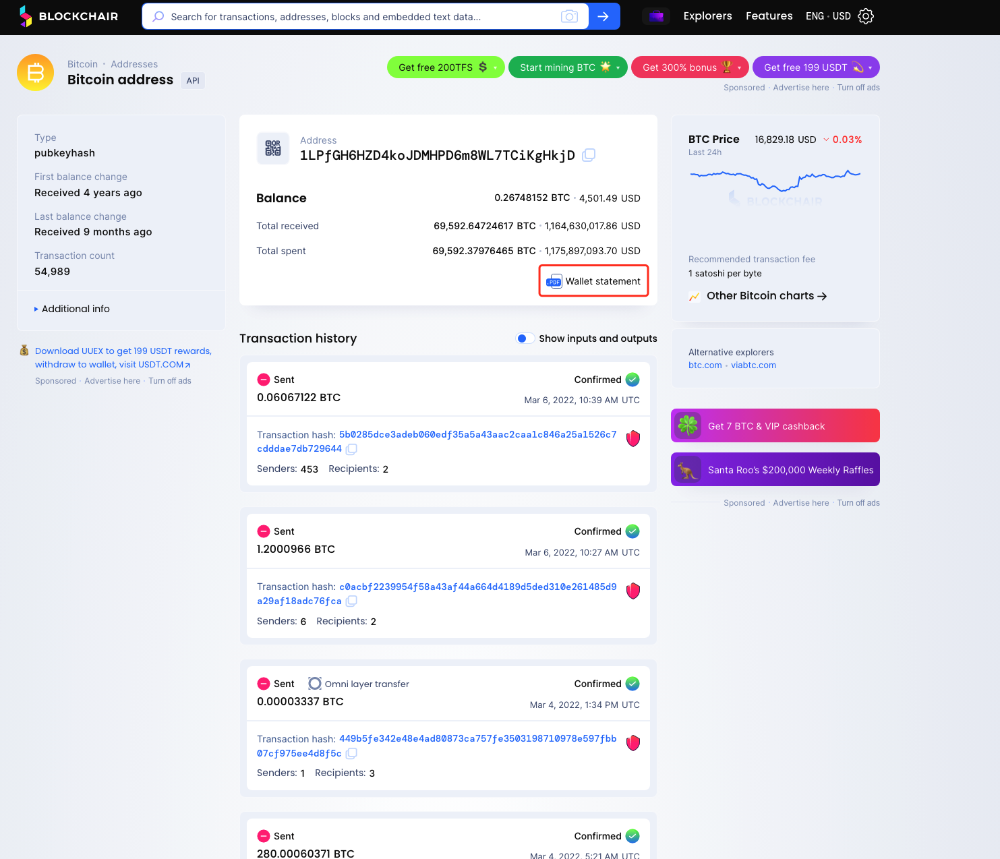
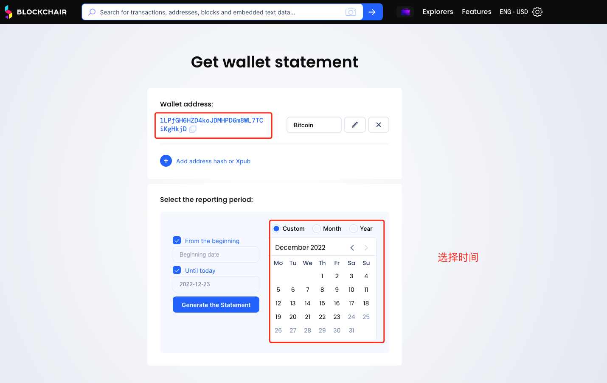
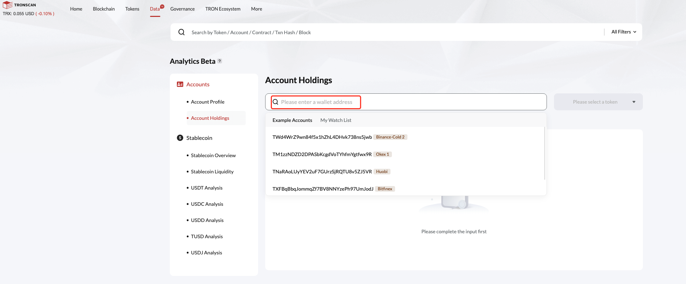
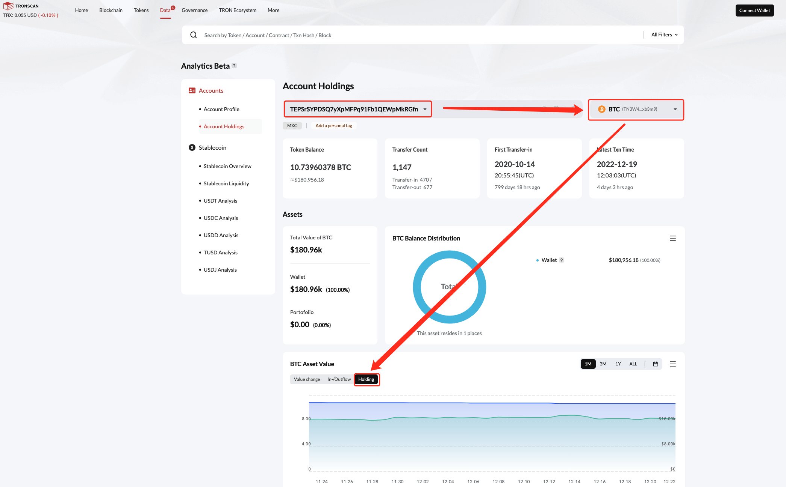

## MEXC 如何验证钱包地址余额？

### 1.准备工作

#### 1.1.1 Windoors 用户
1. 下载对应代码
* url :https://github.com/MXCDev/proof-of-address-balance.git
2. 下载对应可执行文件
* url :https://github.com/MXCDev/proof-of-address-balance/releases/download/v0.1.0/checkBalance_v0.1.0_windows.tar.gz

#### 1.1.2 Mac/Linux 用户
1. 下载对应代码
* url :https://github.com/MXCDev/proof-of-address-balance.git
2. 下载对应可执行文件
* url :https://github.com/MXCDev/proof-of-address-balance/releases/download/v0.1.0/checkBalance_v0.1.0_mac.tar.gz
* url :https://github.com/MXCDev/proof-of-address-balance/releases/download/v0.1.0/checkBalance_v0.1.0_linux.tar.gz

#### 1.2 下载储备文件
* url :https://github.com/MXCDev/proof-of-address-balance/raw/main/address_info.xlsx

**把下载的储备证明文件和验证工具存储到同一个文件夹里**

#### 1.3 支持币种
|币种|网络|
|----|----|
|USDT|Ethereum|
|USDT|BITCOIN|
|USDT|Arbitrum|
|USDT|BSC|
|USDT|OP|
|USDT|HECO|
|USDT|MATIC|
|USDT|OKC|
|USDT|SOL|
|ETH|Ethereum|
|ETH|Arbitrum|
|ETH|BSC|
|ETH|OP|
|ETH|OP|
|ETH|TRON|
|BTC|BTC|
|BTC|BSC|
|BTC|Ethereum|
|USDC|Ethereum|
|USDC|BSC|
|USDC|SOL|
|USDC|TRON|

### 2. 验证钱包地址余额

#### 2.1 验证BTC链的余额
1. 打开blockchain浏览器
* url:https://blockchair.com/
搜索对应的钱包地址，如下图所示


2.点击【Wallet stattement】按钮，并选择对应的时间点，进行查询，如下图所示


3.下载对应的文件，进行查询即可

#### 2.2 验证类ETH链的余额
**注意:以下链均可使用该方法查询【ETH,BSC,OP,ARB,OKC,MATIC,HECO】**

**如果没有对应的python3的环境请提前进行安装**
##### 2.2.1 windows 用户
1. 方法1:直接使用代码验证
下载对应代码库中的代码，下载完成之后，进行如下操作：
```bash
# clone 代码
git clone 
#install package
#打开cmd，进入对应的文件夹
pip3 install -r requestments.txt

#运行程序
##检验全部
python3 checkBalance.py --file="coin.xlsx"

##验证单个地址
python3 checkBalance.py --chain="eth" --address="0x75e89d5979e4f6fba9f97c104c2f0afb3f1dcb88" --name="usdt" --file="coin.xlsx"
```

2. 方法2:直接使用使用可执行文件
```bash
#运行程序
##检验全部
checkBalance.exe --file="coin.xlsx"

##验证单个地址
checkBalance.exe --chain="eth" --address="0x75e89d5979e4f6fba9f97c104c2f0afb3f1dcb88" --name="usdt" --file="coin.xlsx"
```

##### 2.2.2 Mac / Linux
1. 方法1:直接使用代码验证
下载对应代码库中的代码，下载完成之后，进行如下操作：
```bash
#install package
#打开cmd，进入对应的文件夹
pip3 install -r requestments.txt

#运行程序
##检验全部
python3 checkBalance.py --file="coin.xlsx"

##验证单个地址
python3 checkBalance.py --chain="eth" --address="0x75e89d5979e4f6fba9f97c104c2f0afb3f1dcb88" --name="usdt" --file="coin.xlsx"
```

2. 方法2:直接使用使用可执行文件
```bash
#运行程序
##检验全部
./checkBalance --file="coin.xlsx"

##验证单个地址
./checkBalance --chain="eth" --address="0x75e89d5979e4f6fba9f97c104c2f0afb3f1dcb88" --name="usdt" --file="coin.xlsx"
```

#### 2.3 验证TRON链的余额
1. usdt可以通过工具进行验证，方法和eth的相同，仅需要替换对应的币种和地址还有链名称

2. tron链的BTC，ETH以及其他币种可以通过浏览器进行验证，链接如下，按照下图所示进行操作即可。
* url:https://tronscan.io/#/data/analytics/account/holdings

进入浏览器


搜索需要查询的地址，点击需要查询的币种和持仓数据



#### 2.4 验证SOL链的余额

##### 2.4.1 windows 用户
1. 方法1:直接使用代码验证
下载对应代码库中的代码，下载完成之后，进行如下操作：
```bash
#install package
#打开cmd，进入对应的文件夹
pip3 install -r requestments.txt

#运行程序
##检验全部
python3 checkBalance.py --file="coin.xlsx"

##验证单个地址
python3 checkBalance.py --chain="sol" --address="5PAhQiYdLBd6SVdjzBQDxUAEFyDdF5ExNPQfcscnPRj5" --name="usdt" --file="coin.xlsx"
```

2. 方法2:直接使用使用可执行文件
```bash
#运行程序
##检验全部
checkBalance.exe --file="coin.xlsx"

##验证单个地址
checkBalance.exe --chain="sol" --address="5PAhQiYdLBd6SVdjzBQDxUAEFyDdF5ExNPQfcscnPRj5" --name="usdt" --file="coin.xlsx"
```

##### 2.4.2 Mac / Linux
1. 方法1:直接使用代码验证
下载对应代码库中的代码，下载完成之后，进行如下操作：
```bash
#install package
#打开cmd，进入对应的文件夹
pip3 install -r requestments.txt

#运行程序
##检验全部
python3 checkBalance.py --file="coin.xlsx"

##验证单个地址
python3 checkBalance.py --chain="sol" --address="5PAhQiYdLBd6SVdjzBQDxUAEFyDdF5ExNPQfcscnPRj5" --name="usdt" --file="coin.xlsx"
```

2. 方法2:直接使用使用可执行文件
```bash
#运行程序
##检验全部
./checkBalance --file="coin.xlsx"

##验证单个地址
./checkBalance --chain="sol" --address="5PAhQiYdLBd6SVdjzBQDxUAEFyDdF5ExNPQfcscnPRj5" --name="usdt" --file="coin.xlsx"
```

